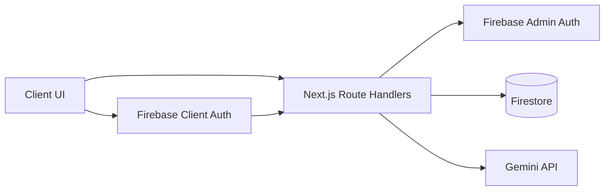
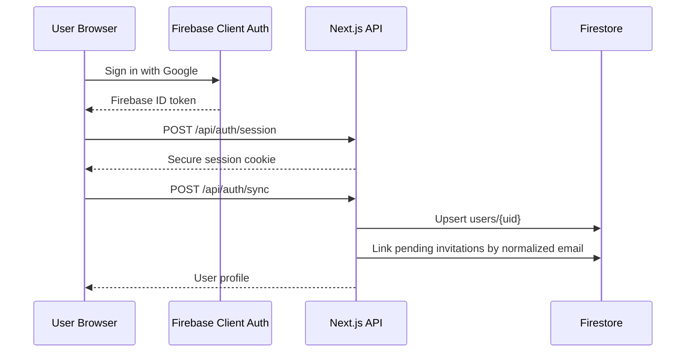
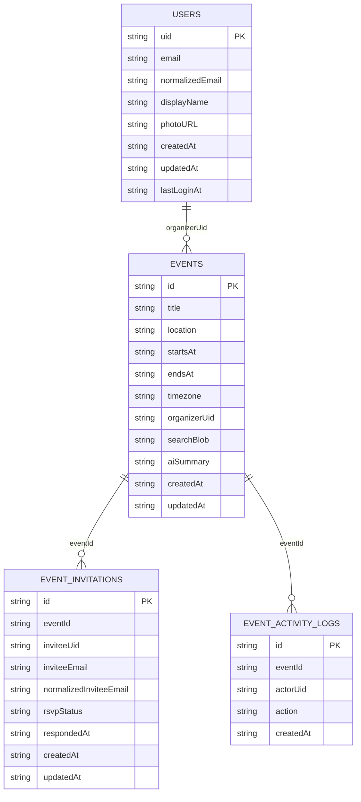

# Version 5 Event Scheduler Application

Mobile-first event scheduler built with Next.js App Router, Firebase Auth/Firestore, and Gemini AI.

Live URL: `TODO_ADD_VERCEL_URL`

## Highlights

- Google SSO via Firebase Auth
- Invite-only events with email-based invitations
- Organizer-owned event CRUD
- RSVP tracking per attendee: `attending`, `maybe`, `declined`
- Pending invite linking when invited users sign in later
- Search by title, location, scope, and status
- AI scheduling assistant for conflict-aware event planning
- Dashboard analytics for visible schedule density and invitation response patterns
- Basic SEO with metadata, `robots.txt`, and `sitemap.xml`

## Tech Stack

- Next.js 16 App Router
- TypeScript strict
- Tailwind CSS v4
- Firebase Auth + Firestore
- Gemini API via `@google/genai`
- Vitest + Playwright
- pnpm
- Vercel deployment target

## Architecture



### Auth and Invite Linking



### Core Data Model



## Routes

Protected pages:

- `/events`
- `/events/[id]`
- `/invitations`
- `/dashboard`

Public pages:

- `/login`

## API Surface

- `POST /api/events`
- `GET /api/events`
- `GET /api/events/:id`
- `PATCH /api/events/:id`
- `DELETE /api/events/:id`
- `POST /api/events/:id/invitations`
- `GET /api/invitations`
- `PATCH /api/invitations/:id/rsvp`
- `GET /api/analytics/overview`
- `POST /api/ai/scheduling-assistant`
- `POST /api/auth/session`
- `DELETE /api/auth/session`
- `POST /api/auth/sync`

## Environment Variables

Copy `.env.example` to `.env.local` and fill the values.

```bash
cp .env.example .env.local
```

Required values:

- `NEXT_PUBLIC_APP_URL`
- `NEXT_PUBLIC_FIREBASE_API_KEY`
- `NEXT_PUBLIC_FIREBASE_AUTH_DOMAIN`
- `NEXT_PUBLIC_FIREBASE_PROJECT_ID`
- `NEXT_PUBLIC_FIREBASE_STORAGE_BUCKET`
- `NEXT_PUBLIC_FIREBASE_MESSAGING_SENDER_ID`
- `NEXT_PUBLIC_FIREBASE_APP_ID`
- `FIREBASE_PROJECT_ID`
- `FIREBASE_CLIENT_EMAIL`
- `FIREBASE_PRIVATE_KEY`
- `GEMINI_API_KEY`

## Local Development

```bash
pnpm install
pnpm dev
```

Open `http://localhost:3000`.

## Database Seeding

A deterministic demo seed script is included.

Recommended command:

```bash
pnpm seed:demo --access-email=your-google-email@example.com
```

Other modes:

```bash
pnpm seed:demo
pnpm seed:demo --dry-run
pnpm seed:demo --force --access-email=your-google-email@example.com
```

Safety notes:

- Seed is destructive for Firestore collections used by this app.
- By default it only allows project IDs containing `test`, `dev`, `staging`, `sandbox`, or `demo`.
- `--force` bypasses that guard.
- The script does not create Firebase Auth users.

## Quality Commands

```bash
pnpm lint
pnpm typecheck
pnpm test
pnpm test:e2e
pnpm build
```

## Deployment (Vercel)

1. Import the repository in Vercel.
2. Add all env vars from `.env.example`.
3. Set `NEXT_PUBLIC_APP_URL` to your deployed domain.
4. Add the Vercel domain to Firebase Auth authorized domains.
5. Deploy and verify:
   - `/login`
   - `/robots.txt`
   - `/sitemap.xml`
   - event creation
   - invitation flow
   - RSVP updates

## SEO Notes

- Global metadata is defined in `app/layout.tsx`
- Protected routes are marked `noindex`
- `app/robots.ts` disallows protected app paths and APIs
- `app/sitemap.ts` exposes public URLs only

## PR Roadmap

1. `chore/01-foundation-readme-env`
2. `feat/02-ui-shell-seo`
3. `feat/03-firebase-auth-session-profiles`
4. `feat/04-events-crud`
5. `feat/05-invitations-rsvp`
6. `feat/06-search-date-filters-agenda-view`
7. `feat/07-ai-scheduling-assistant`
8. `feat/08-dashboard-inbox-analytics`
9. `chore/09-deterministic-seeding`
10. `chore/10-quality-ci-readme-final`

## Known Limitations

- No recurring events in v1
- No outbound email sending in v1
- Search is scoped to visible events only and currently optimized for interview-scale data
- Charts are custom UI components rather than a dedicated charting library